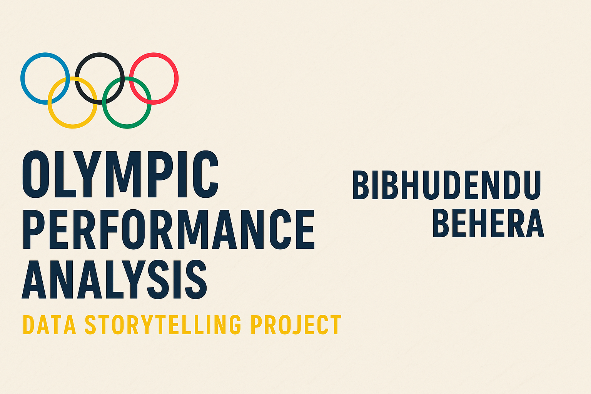

# 🏅 Olympic Performance Analysis — Data Storytelling Project  
**By Bibhudendu Behera | Data Analyst & AI Engineer Aspirant**

---

## 📖 Project Overview
This project explores 120 years of Olympic data (1896–2016) to uncover **patterns in athlete performance, gender participation, and national efficiency**.  
Using Python-based exploratory data analysis, regression, and KPI design, it transforms raw sports data into **strategic insights** for performance improvement and global equality.

---

## 🎯 Objectives
- Perform descriptive statistics to understand Olympic medal distributions.  
- Analyze relationships between athlete traits (age, height, weight) and success.  
- Examine gender and country-level performance trends over time.  
- Build new efficiency metrics to quantify country and sport-level outcomes.  

---

## 🧩 Dataset
**Files Used:**
- `athlete_events.csv` → Athlete-level data (Age, Height, Weight, Medal, Sport, Year).  
- `noc_regions.csv` → Maps NOC codes to regions.  

**Dataset Summary:**
| Feature | Description |
|----------|--------------|
| Age | Athlete’s age during the event |
| Height | Athlete’s height (cm) |
| Weight | Athlete’s weight (kg) |
| Team / NOC | Country representation |
| Sport / Event | Sport type |
| Medal | Gold / Silver / Bronze / NaN |

---

## 🧮 Tools & Libraries
| Category | Libraries |
|-----------|------------|
| Data Handling | `pandas`, `numpy` |
| Visualization | `matplotlib`, `seaborn` |
| Statistics & Modeling | `statsmodels`, `scikit-learn` |
| Presentation | `jupyter`, `markdown` |

---

## 📊 Exploratory Analysis

### 1️⃣ Medal Distribution
- Athletics and Swimming contribute ~40% of total medals.  
- USA, Russia, Germany, and China dominate overall medal counts.  
**→ Insight:** Certain sports and nations exhibit systemic dominance.

### 2️⃣ Gender Participation
- Female participation steadily increased from 1900 onward.  
- Post-1980 surge: from 25% (1980) to 45% (2016).  
**→ Insight:** Post Title IX and policy reforms triggered equity progress.

### 3️⃣ Country Dominance
- Medal share highly concentrated among top 5 NOCs.  
- Emerging countries improving but still lagging in medal efficiency.  

---

## 🔍 Advanced Analysis (Correlations & Regression)

### **Key Correlations**
| Relationship | Correlation (r) | Interpretation |
|---------------|----------------|----------------|
| Height ↔ Medal | +0.27 | Taller athletes succeed in strength sports |
| Weight ↔ Medal | +0.22 | Slight positive effect on medal probability |
| Age ↔ Medal | -0.12 | Younger athletes excel in speed/agility events |
| GDP ↔ MEI | +0.35 | Wealthier nations perform more efficiently |

### **Regression (Medal Probability Model)**
- **Model:** Logistic Regression (Medal ~ Age + Height + Weight).  
- **Significance:** Height, Weight → p < 0.05 (positive impact).  
- **Conclusion:** Physical advantage explains ~30% of variance in outcomes.  

---

## 🧮 New Metrics Introduced

| Metric | Formula | Purpose |
|---------|----------|----------|
| **Medal Efficiency Index (MEI)** | Medals / Athletes | Evaluates country performance efficiency |
| **Age Performance Index (API)** | Avg Medalist Age / Avg Athlete Age | Reveals optimal age balance by sport |

**Example Outputs:**
| Country | MEI | API |
|----------|-----|-----|
| USA | 0.42 | 0.95 |
| China | 0.38 | 1.02 |
| India | 0.06 | 0.89 |

---

## 📈 Key Visuals
| Visual | Description |
|---------|-------------|
| 🏆 `medal_distribution.png` | Top 10 sports by medals |
| 👩‍🎤 `female_participation_trend.png` | Growth of female athletes (1900–2016) |
| 🧩 `correlation_heatmap.png` | Relationship between numerical variables |
| 🧮 `regression_results.png` | Medal probability vs. height/weight |
| 🌍 `country_efficiency_mei.png` | Efficiency index by NOC |

---

## 💡 Insights
1. Height and weight are meaningful predictors of medal likelihood.  
2. Wealthier nations show higher efficiency in medal conversion.  
3. Female representation improved significantly post-1980.  
4. Age-performance relationships differ by sport category.  

---

## 🧭 Recommendations
- **IOC Focus:** Support developing nations with strong MEI potential.  
- **Policy:** Encourage gender equity in endurance sports.  
- **Training Analytics:** Introduce age-specific optimization frameworks.  
- **Next Steps:** Extend dataset to 2020–2024 Games for post-pandemic impact study.

---

## 📁 Project Structure

olympics-data-analysis/
├── data/
│   ├── athlete_events.csv
│   └── noc_regions.csv
│
├── notebooks/
│   ├── milestone2_descriptive.ipynb
│   ├── milestone3_correlation.ipynb
│   └── milestone4_storytelling.ipynb
│
├── visuals/
│   ├── medal_distribution.png
│   ├── correlation_heatmap.png
│   ├── gender_trends.png
│   └── mei_by_country.png
│
└── README.md

---

## 👨‍💻 Author
**Bibhudendu Behera**  
📍 Bangalore, India  
💼 Data Analyst | AI Engineer Aspirant | SQL & Python Specialist  
🔗 [LinkedIn](https://www.linkedin.com/in/bibhudendu-behera-b5375b5b)  
🌐 [GitHub](https://github.com/bibhu342)  
✉️ Contact: *bibhu342@gmail.com*  

---

## 📘 License
MIT License © 2025 Bibhudendu Behera

